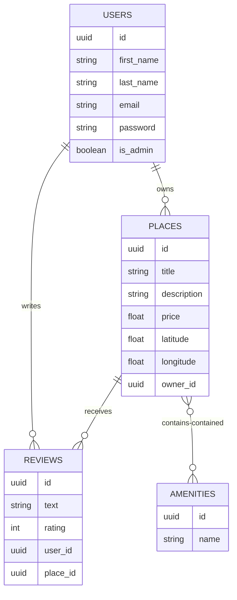

# [HBnB - Auth and DB](https://intranet.hbtn.io/projects/3212)
**Part 3: Implementation of tokens and database**

## Database Diagrams
Due to database being unfinished, here is what it could have been.
